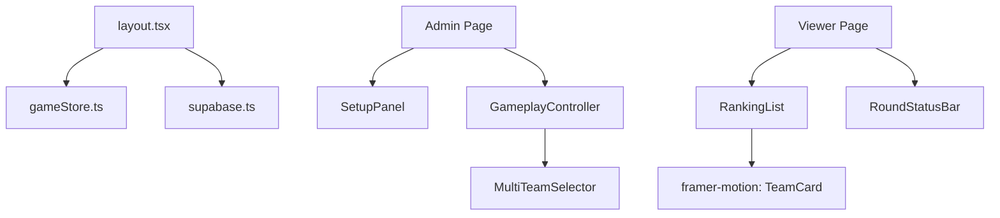

# _ARCH_DRAFT_v1.md: Technical Architecture

## 1. Data Store Strategy (Zustand + Supabase)
- **State Management**: Zustand store (`useGameStore`) for UI state and optimistic updates.
- **Sync Engine**: 
    - `fetchGameData()`: Initial load of `teams` and `game_config`.
    - `subscribeToChanges()`: Supabase Realtime channel for `teams` and `game_config` (UPDATE/INSERT).
- **Optimistic Updates**: Immediate UI feedback for point awarding before DB confirmation.

## 2. Core Scoring Logic
- **`awardPoints(winnerIds: string[])`**:
    1.  Get current round index from `game_config.current_round`.
    2.  Get points for the round from `game_config.round_weights[current_round]`.
    3.  Iterate through `winnerIds` and increment `teams.total_score`.
    4.  Update `game_config.current_round` (next).
    5.  Push `score_logs` for traceability.

## 3. Component Hierarchy

## 4. Resilience & Edge Cases
- **Stale State**: Versioning or Timestamp checks for concurrent Admin updates.
- **Network Flaky**: Automatic reconnection for Realtime subscriptions.
- **Input Debouncing**: `onBlur` sync for configuration fields to prevent rate limiting.
